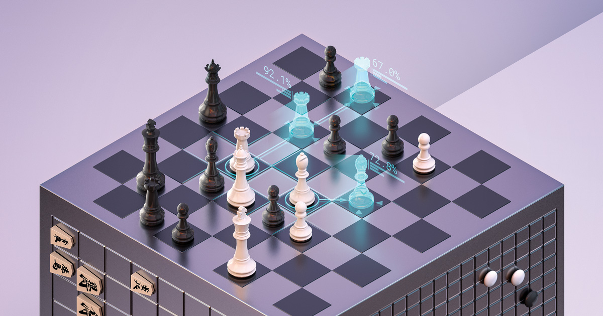

# awesome-chess-ai

A comprehensive collection of resources focused on the intersection of AI and chess. This repository includes a wide variety of materials such as books, research papers, and links to related projects. It aims to be a valuable reference for developers, researchers, and chess enthusiasts interested in chess AI.

## Table of contents

- [Projects](#projects-🛠️)
    - [AlphaZero](#alphazero)
    - [LeelaZero](#leelazero)
- [Books](#books-📚)
- [Papers](#papers-📃)
    - [Chess deepfakes](#chess-deepfakes)
    - [Reinforcement learning](#reinforcement-learning)
    - [Natural language processing](#natural-language-processing)
    - [Explainability](#explainability)
    - [Miscellaneous](#miscellaneous)

## Projects 🛠️

### AlphaZero

https://www.chessprogramming.org/AlphaZero

https://www.deepmind.com/blog/alphazero-shedding-new-light-on-chess-shogi-and-go

### LeelaZero

https://lczero.org/

https://github.com/LeelaChessZero

https://www.chessprogramming.org/Leela_Chess_Zero

## Books 📚

[Neural Networks For Chess](https://github.com/asdfjkl/neural_network_chess)

## Papers 📃

### Chess deepfakes

[Aligning Superhuman AI with Human Behavior: Chess as a Model System](https://arxiv.org/abs/2006.01855)

[Learning Models of Individual Behavior in Chess](https://arxiv.org/abs/2008.10086)

[Style Transfer Generative Adversarial Networks: Learning to Play Chess Differently](https://arxiv.org/abs/1702.06762v1)

### Reinforcement learning

[A general reinforcement learning algorithm that masters chess, shogi, and Go through self-play](https://www.deepmind.com/publications/a-general-reinforcement-learning-algorithm-that-masters-chess-shogi-and-go-through-self-play)

[Mastering Chess and Shogi by Self-Play with a General Reinforcement Learning Algorithm](https://arxiv.org/abs/1712.01815)

[Giraffe: Using Deep Reinforcement Learning to Play Chess](https://arxiv.org/abs/1509.01549)

### Natural language processing

[Chess Q&A : Question Answering on Chess Games](http://multicomp.cs.cmu.edu/wp-content/uploads/2017/09/2015_RAM_cirik_chess.pdf)

[Watching a Language Model Learning Chess](https://aclanthology.org/2021.ranlp-1.153/)

[Learning to Generate Move-by-Move Commentary for Chess Games from Large-Scale Social Forum Data](https://aclanthology.org/P18-1154/)

[Automated Chess Commentator Powered by Neural Chess Engine](https://paperswithcode.com/paper/190910413)

[Improving Chess Commentaries by Combining Language Models with Symbolic Reasoning Engines](https://arxiv.org/abs/2212.08195)

[The Chess Transformer: Mastering Play using Generative Language Models](https://arxiv.org/abs/2008.04057)

[Learning Chess With Language Models and Transformers](https://arxiv.org/abs/2209.11902)

[SentiMATE: Learning to play Chess through Natural Language Processing](https://arxiv.org/abs/1907.08321)

### Explainability

[Acquisition of Chess Knowledge in AlphaZero](https://arxiv.org/abs/2111.09259)

### Miscellaneous

[Chess AI: Competing Paradigms for Machine Intelligence](https://arxiv.org/abs/2109.11602)

[DeepChess: End-to-End Deep Neural Network for Automatic Learning in Chess](https://arxiv.org/abs/1711.09667)

[Playing Chess with Limited Look Ahead](https://arxiv.org/abs/2007.02130)

[Learning to Play Chess with Minimal Lookahead and Deep Value Neural Networks](https://www.ai.rug.nl/~mwiering/Thesis_Matthia_Sabatelli.pdf)

[Zipf's Law in the Popularity Distribution of Chess Openings](https://www.researchgate.net/publication/43021133_Zipf's_Law_in_the_Popularity_Distribution_of_Chess_Openings)
